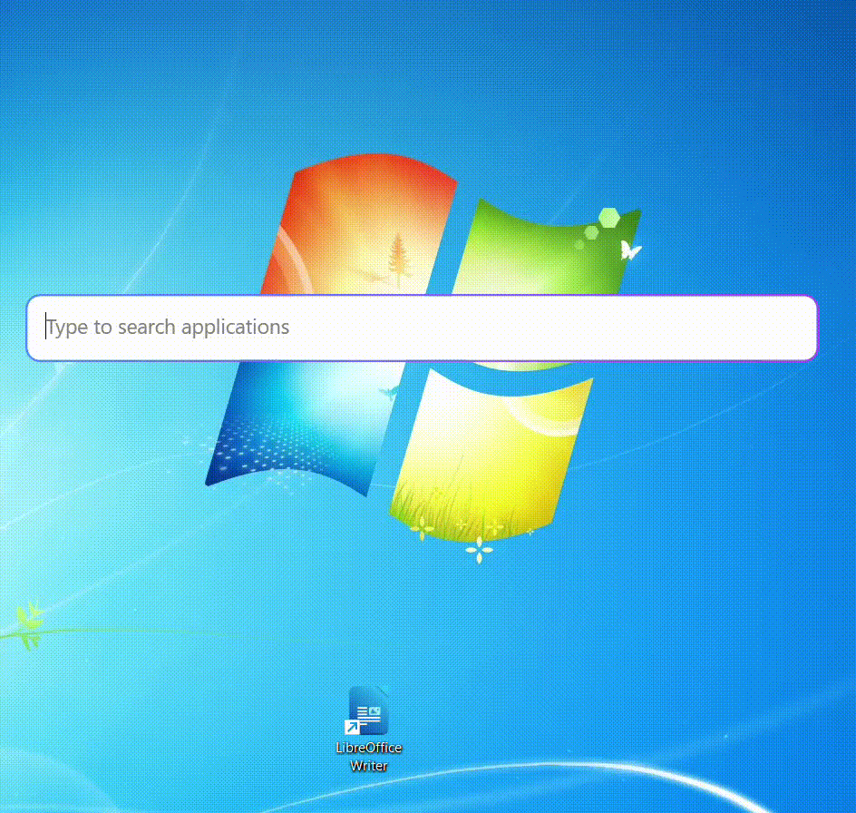

# Nova

Nova is an application launcher written in C#(.NET 10) using WPF and WinAPI(Interop classes). It is designed to be fast and efficient, allowing users to quickly access their applications with ease.

It is built for Windows 11. I have not tested it on Windows 10.

# View in action

No, I am not running Windows 7, I just love the wallpaper :).

Also, the gif converter has not converted the colours correctly, so it does not look exactly like this.

# Features

1. Fast and efficient application launching.
2. Manually binds to Alt + Space key combination to open the launcher.
3. Hides in the tray waiting to be launched using the key combination.
4. Displays a list of installed applications for quick access.
5. Launches an application when the user taps Enter or double clicks on it.
6. Closes when the user presses the Esc key.
7. Supports keyboard navigation of the app list using the up and down arrow keys.
8. Scans the global and user Start Menu for installed applications and displays them in the launcher
	- alphabetically sorted
	- duplicate entries removed

Currently only supports launching applications from the Start Menu. Support for launching applications from the desktop and other locations, as well as files, mathematical expressions, URL locations, GitHub search, YouTube search et cetera will be added in future updates.

# Roadmap

Look here: [Roadmap](https://github.com/IcyDrae/Nova/issues/1)

# How to download

Go here for the latest ClickOnce release: [Releases](https://github.com/IcyDrae/Nova/issues/1).

# Wanna get involved?

Look at the roadmap issue and pick a task!

# License

This project is licensed under the GNU General Public License v3.0.

